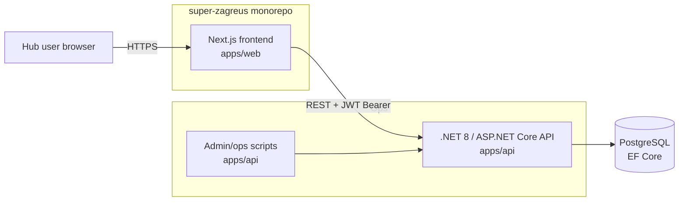

# Zagreus — MVP Technical Design Spec

**Product:** Zagreus — partner portal for DistributeAid
**Document status:** Draft for review — v0.1
**Date:** 2026-07-16
**Author:** Corey (with Claude)
**Companion:** requirements live in `2026-07-16-zagreus-mvp-prd.md`. This document does not restate requirements; it describes how the MVP is built. Where they disagree, the PRD wins.

---

## 1. Scope

This spec covers both the **frontend** and the **backend** for the MVP, built together in the **`super-zagreus` monorepo** (see §2.1 for the repository decision). It assumes the reconciled product model in the PRD (hub org → single project/region → confirmable assessment of needs, locked default units, structured missing-item requests, login-only frontend). The backend carries over the existing `zagreus-be` .NET solution, consolidated into the monorepo.

## 2. Architecture

Two tiers, communicating over HTTPS with JWT bearer auth. The frontend holds **no database**; all persistence is via the backend API.



- **Frontend** (`apps/web`): Next.js 16 App Router. Renders partner UI, holds session, calls the API. Server-side route handlers/server components proxy API calls where it helps keep the JWT off the client.
- **Backend** (`apps/api`): .NET 8 / ASP.NET Core / PostgreSQL / EF Core API (the `zagreus-be` solution, consolidated in). Source of truth for all data, auth, and the seeded catalog.
- **Ops scripts** (`apps/api`): provisioning and credential-reset utilities that call the API (or run against the DB) with a DA admin token.

### 2.1 Repository decision — monorepo

**Decision:** all Zagreus code — frontend and backend — lives in the single **`super-zagreus`** repository, replacing the separate `zagreus-fe` and `zagreus-be` prototypes.

**Rationale:** both prototype repos were fresh scaffolds (`zagreus-fe` 2 commits, `zagreus-be` 1 commit), so there was negligible history, CI, or deployment investment to preserve — consolidating now is cheap. A monorepo gives a small volunteer team building FE and BE in lockstep: atomic cross-cutting changes (an API change and its consumer in one PR, so the two never drift), one home for specs/issues/docs, and simpler onboarding (one clone).

**Cost accepted:** this is a polyglot repo (.NET + Node/Next.js), which both assume owns the repo root. Managed via a clear directory split and path-scoped CI (build only what changed). Deployment targets stay independent (web → Vercel, api → server/Docker+Postgres) — separate deployment does not require separate repos.

**Revisit if:** the backend API needs to be consumed by other DA applications beyond Zagreus, at which point a standalone API repo may earn its keep.

Layout:

```
super-zagreus/
  apps/
    web/     # Next.js 16 frontend (Yarn 4)
    api/     # .NET 8 / ASP.NET Core solution (from zagreus-be)
  docs/superpowers/specs/
```

## 3. Frontend stack & conventions

- **Framework:** Next.js 16 (App Router), React 19, TypeScript, Yarn 4 (matching the DA house stack).
- **UI:** Radix UI + Tailwind CSS, following DA website conventions — **named color tokens, no raw hex in components**.
- **Validation:** Zod for form and API-response schemas.
- **Forms:** **React Hook Form + Zod** (via `@hookform/resolvers`). Chosen over Formik (effectively unmaintained) and TanStack Form after a DX-focused comparison: RHF's mature ecosystem, documented composition patterns (`useFormContext` so field components read state without prop-drilling; reusable typed inputs), `useFieldArray` fit for dynamic line-item forms like the needs list, and deep Testing-Library prior art best suit a rotating volunteer team maintaining forms that will grow in complexity. Centralized Zod schemas stay independently unit-testable. (TanStack Form was the runner-up — stronger end-to-end type inference — but its thinner ecosystem raised the maintenance cost for this team. Note: our authoritative validation is the .NET API; client-side Zod is for UX, so server-action-native options like Conform were not a fit.)
- **Auth:** Auth.js (NextAuth) configured with **Google** and **Microsoft Entra** OAuth providers; see §7. (Confirm Auth.js compatibility with Next.js 16 / React 19 during planning; fall back to a direct OIDC client if needed.)
- **Testing:** Vitest + Testing Library (jsdom), following DA's query-priority conventions; avoid `beforeEach` state leakage (setup-function pattern).
- **Tooling:** ESLint (`eslint-config-next`) + Prettier. **License: AGPL-3.0** (matching DA repos).
- **Project structure** (DA convention, within `apps/web`): `src/app` (routes), `src/app/api` (server-side handlers/proxy), `src/components`, `src/data` (API client + types; nothing data-related inline in components).

## 4. Data model (as consumed from the API)

The backend owns these entities; the frontend consumes them. Shapes below are the frontend's working view, to be confirmed against the actual entities during planning.

- **User**: `id`, `email` (the verified Google/Microsoft identity — no password), `orgId`, `role`. DA-authorized; matched to the signed-in identity by email.
- **Organisation** (hub): `id`, `name`.
- **Project**: `id`, `orgId`, `name`, `region`. MVP uses one default project per org.
- **Assessment**: `id`, `projectId`, `status` (draft/current), `submittedAt` (freshness). "Current assessment" is fetched per project.
- **AssessmentItem** (a need): `id`, `assessmentId`, `itemTypeId`, `quantity`, `unitId`, `notes`, plus optional `locationNote` and `urgency` (see §8 additions).
- **Category / ItemType** (catalog reference): categories with item types; each item type has a default unit. Read-only.
- **Unit** (reference): fixed set — item, box, pallet, kg, lb, litre, gallon — each a stable GUID.
- **MissingItemRequest** (new): `id`, `orgId`/`projectId`, free-text description, `createdAt`, status. See §8.

## 5. API surface used by the MVP

From the existing backend (confirmed via its README/Bruno collection):

- `POST /api/auth/session` — exchange a verified Google/Microsoft ID token for an app session/JWT carrying `user` + org/role claims (replaces the prototype's username/password `login`). See §7.
- `GET /api/categories` (public) — catalog categories + item types
- `GET /api/units` (public) — units
- `POST /api/organisations/{orgId}/projects` / list projects — project + region
- `POST /api/projects/{projectId}/assessments` — create draft
- `GET /api/projects/{projectId}/assessments/current` — current needs
- `POST /api/assessments/{assessmentId}/items` — add a need (`itemTypeId`, `quantity`, `unitId`, `notes`)
- edit/remove item endpoints (to confirm)
- `POST /api/assessments/{assessmentId}/submit` — "confirm current needs" (requires ≥1 item)
- **new:** missing-item request endpoint (see §8)

## 6. Screens & module boundaries

Each screen is a route under `src/app`, composed from `src/components`, talking to a typed API client in `src/data`.

1. **Login** (`/login`) — "Sign in with Google" / "Sign in with Microsoft" buttons → OAuth flow → establish session → redirect. No password or reset UI.
2. **Current needs** (`/`, authed) — the project's current assessment as an editable list, grouped by category; shows "last confirmed" freshness. Actions: add, edit, remove, **Confirm current needs**.
3. **Add/edit need** (modal or `/needs/new`, `/needs/[id]`) — catalog picker (browse by category + search), quantity in the item's **locked default unit** (unit shown, not chosen), optional location note, urgency, item notes. Built with React Hook Form + Zod (`useFieldArray` for the needs list).
4. **Confirm needs** — action on the current-needs screen; calls submit; surfaces the requirement of ≥1 item; updates freshness.
5. **Missing-item request** (`/needs/request` or modal) — structured free-text request form → new endpoint.
6. **Reporting / summary** (`/summary`, authed) — current needs grouped by category with totals + last-confirmed date; **Export CSV** (client-side).

Shared modules: `src/data/apiClient` (fetch wrapper injecting the token, handling 401/expiry), `src/data/types` (Zod schemas + inferred types), `src/components/ui` (Radix + Tailwind primitives themed to DA tokens).

## 7. Auth & session handling

**Authentication** is delegated to Google/Microsoft via OAuth 2.0 / OIDC (Authorization Code + PKCE). Zagreus stores no passwords. **Authorization** (which org a user belongs to, their role) stays in the backend — the identity provider proves *who* the user is; it knows nothing about DA's organisations.

Flow:

1. On `/login`, the user picks **Google** or **Microsoft**; Auth.js runs the OIDC authorization-code flow and returns a **verified identity** (notably the verified `email`).
2. The Next.js server exchanges that verified identity with the backend at `POST /api/auth/session` (passing the provider ID token). The backend **verifies the provider token** (issuer = Google/Microsoft, audience = our client, signature via the provider's JWKS), looks up the **User by email**, and — if that email is authorized — returns an **app session JWT** carrying the user's org + role claims. Unauthorized email → `401`, and the UI shows an "access not provisioned" message.
3. The app JWT is stored in an **httpOnly, Secure, SameSite cookie** set by a Next.js route handler — never in `localStorage`, never exposed to client JS.
4. API calls go through a **server-side proxy** (`src/app/api/...`) / server actions that read the cookie and attach `Authorization: Bearer <app JWT>`. The backend authorizes each request from the JWT's org/role claims.

- **Why an app JWT (not the raw provider token):** it preserves the backend's existing JWT-based authorization (org/role claims, cheap per-request validation) while replacing the *credential* step with OAuth. The provider token is only used once, at session establishment.
- **Expiry:** app JWT lifetime stays short (the prototype used 8h). On a `401`, the proxy clears the cookie and redirects to `/login`; re-authentication is a silent provider round-trip if the provider session is still active. No custom refresh-token machinery in MVP.
- **Route protection:** Next.js middleware guards authed routes by presence/validity of the session cookie.
- **Provider config:** OAuth client IDs/secrets and allowed redirect URIs for Google and Microsoft live in server-side env (see §13); optionally restrict to specific email domains.

## 8. Backend additions required (`apps/api`)

Small, additive changes — to confirm against the actual entities during planning:

1. **OAuth-based auth** — replace the prototype's username/password login with `POST /api/auth/session`: verify a Google/Microsoft ID token (issuer, audience, JWKS signature), match the verified email to an authorized `User`, and issue the app JWT with org/role claims. Drop password storage/fields; keep the JWT-issuing/validation and org/role model. Add a `User.email` lookup.
2. **Missing-item request** — entity + endpoints (`POST` to create, list for DA). Structured (org/project, description, timestamp, status).
2. **Optional need fields** — `locationNote` (free text) and `urgency` (lightweight) on `AssessmentItem`, if not already present. The PRD marks both optional.
3. **Freshness on confirm** — verify `submit` sets/updates the timestamp used for staleness; expose it on the current-assessment response so the frontend can show "last confirmed." (Aligns with the existing `DA.NA.Staleness` module.)
4. **CSV** stays **frontend-side** for MVP; `DA.NA.Analytics` remains a placeholder.

## 9. Admin / ops scripts (`apps/api`)

Delivered with the MVP to keep DA's manual overhead low (see PRD §3):

1. **Provision hub** — create an organisation and **authorize its first user by email** with a role (e.g., `OrgAdmin`), using a DA admin token. No password is set — the user gains access on first Google/Microsoft sign-in with that email. Idempotent where practical.
2. **Authorize / deauthorize a user** — add or remove an authorized email (with role) for an org.

No credential-reset script is needed — password recovery is handled entirely by Google/Microsoft. Form factor to decide in planning: .NET console commands in the solution, or documented Bruno/CLI flows. Preference: small `dotnet` console tools living beside the API so they share entities/config.

## 10. Design system (DA guidelines → Tailwind)

Encode DA brand tokens in the Tailwind theme; components reference tokens only.

- **Colors:** `da-blue #051E5D` (primary); `da-lavender #DFCDE8`, `da-teal #98BEC6`, `da-green #5AC597` (secondary). Ensure text/background contrast meets accessibility on DA Blue.
- **Type:** Roboto (body/UI) via Google Fonts / `next/font`; Permanent Marker as a **sparing** accent only.
- **Spacing scale:** 8 / 16 / 32 / 64px mapped to Tailwind spacing tokens.
- **Grid & responsive:** 12-col desktop / 8-col tablet / 4-col mobile; gutters 16/12/8; container margins 32/24/16.
- **Alignment/hierarchy:** left-aligned content, centered headings/CTAs, clear H1/H2/H3.
- **Known gaps:** the guidelines' component specs (buttons, nav) and exact font sizes are `[PLACEHOLDER]`. Fill from Radix defaults + DA website patterns; flag open items to DA's design team (Lou Macfly / Sara Lonegard).

## 11. Error handling

- **API/network errors:** typed API client maps non-2xx to a small error type; screens show inline, human-readable messages (never raw payloads). Retry affordance on transient failures.
- **Validation:** Zod on inputs before submit; server validation errors surfaced against the relevant field.
- **Auth errors:** 401 → session cleared → redirect to login (see §7).
- **Empty/edge states:** explicit empty state for "no needs yet"; guard "confirm" when the list is empty (backend requires ≥1 item — mirror that in the UI).

## 12. Testing strategy

- **Frontend unit/component:** Vitest + Testing Library; test the catalog picker, add/edit-need validation, confirm flow, CSV export, and auth redirect behavior. Mock the API client.
- **Backend:** xUnit (exists) for the new missing-item endpoint and any new fields.
- **API contract:** extend the Bruno collection with the new endpoints; use it for manual smoke tests.
- **Verification gate:** run `yarn all` (types, format, lint, test) green before calling work complete.

## 13. Deployment (to confirm — not an MVP blocker)

- **Monorepo CI:** path-scoped pipelines — changes under `apps/web/**` build/test/deploy the frontend; changes under `apps/api/**` build/test/deploy the backend. Each app deploys independently despite sharing the repo.
- **Frontend:** Vercel (DA's website deploy target, with the project root set to `apps/web`) or self-hosted pm2 (DA's other pattern). Env: API base URL, JWT cookie settings.
- **Backend:** .NET + PostgreSQL on DA infrastructure (Docker/managed Postgres). The API requires a `JWT:Key` secret to start.
- **Secrets:** frontend — API base URL, cookie config, and **Google/Microsoft OAuth client IDs + secrets and redirect URIs**; backend — app JWT signing key plus the provider issuer/audience config used to verify ID tokens.

## 14. Open questions / to verify in planning

- Exact backend entity shapes and the full set of item edit/remove endpoints.
- Whether `locationNote`/`urgency` already exist on `AssessmentItem`.
- Confirm `submit` updates the freshness timestamp and how staleness is computed.
- Deployment target for the frontend (Vercel vs self-hosted).
- Google + Microsoft OAuth app registration (client IDs/secrets, redirect URIs) and whether to restrict sign-in to specific email domains.
- Auth.js compatibility with Next.js 16 / React 19 (else a direct OIDC client).
- Final taxonomy-sheet ↔ seeded-catalog mapping (owned by DA).

## 15. Out of scope (MVP)

As per PRD §8: impact/analytics reporting, fulfillment tracking, staff-facing UI, in-app user management, additional identity providers / org SSO, multi-project UI, unit override / local units, frontline-group modeling, PDF export, sourcing/modeling integration.
